# 치매 고위험군 웨어러블 데이터셋을 활용한 분석 및 시각화

- ### 치매 예측 모델
- ### 치매 관리 애플리케이션

---

## [0. 사용 데이터](./dementia_dataset/Demantia_DataSet.md)

### [치매 고위험군 웨어러블 라이프로그(AIHub)](https://aihub.or.kr/aihubdata/data/view.do?currMenu=115&topMenu=100&dataSetSn=226)

> 프로젝트에서 사용될 데이터셋 준비

---

## [1. 데이터 전처리](./data_processing/DataProcessing.md)

> 다양한 모델에 다양한 형태의 데이터 셋을 적용 시켜 정확도를 높이기 위해 기존의 데이터를 다양한 형태로 처리

#### dataset_01

- 원하는 데이터를 추출한 데이터 셋  
- EMAIL을 ID로 변환

#### dataset_02

- 원천 데이터와 라벨 데이터를 결합한 데이터 셋

#### dataset_03

- NaN 값을 같은 ID의 데이터의 평균 또는 같은 라벨링의 평균으로 채운 데이터

#### dataset_04

- NaN 값을 같은 ID의 데이터의 평균 또는 같은 라벨링의 평균으로 채운 데이터의 평균 데이터

#### dataset_05

- NaN 값을 같은 ID의 (데이터의 평균 또는 같은 라벨링의 평균)으로 채운 데이터 셋의 트레이닝 데이터와 검증 데이터를 합친 데이터

#### dataset_06

- NaN 값을 같은 ID의 (데이터의 평균 또는 같은 라벨링의 평균)으로 채운 데이터 셋의 전체 데이터의 라벨링을 기준으로 한 평균 데이터

#### dataset_07

- dataset_05와 dataset_06의 데이터에서 애플 사용자 데이터와 대응 될 수 있는 데이터만 추출

#### dataset_08

- 최종적으로 사용 될 데이터셋
- NaN값을 해당 ID의 평균으로 채운 데이터 셋에서 사용 가능한 데이터를 추출한 데이터셋과 해당 데이터셋의 라벨을 기준으로 한 평균 데이터

---

## [2. 데이터 시각화](./Visualization/README.md)

- 중요도 확인 후 feature들과 치매 정도의 상관관계 분석하기 위한 시각화

---

## [3. 모델 학습](./training/README.md)

>

---

## [4. 서버]()

>

---

## [5. 치매 분석 애플리케이션](https://github.com/BigDataTeamProject/dementia_analytics-iOS/blob/main/README.md)

> 사용자의 생활 데이터를 전달하여 치매 고위험군 웨어러블 데이터셋을 활용한 모델로부터 치매 환자와의 유사도를 분석하는 애플리케이션

### 구성

| 홈                                          | 차트                                          | 설정                                             |
|--------------------------------------------|---------------------------------------------|------------------------------------------------|
| 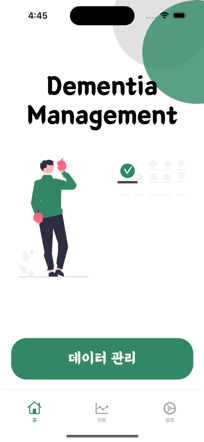 | 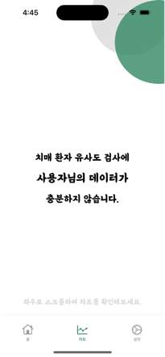 | 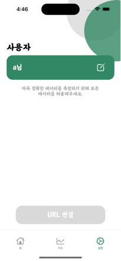 |

### 사용자 건강 데이터 요청

| 아이폰의 건강 데이터 접근                               | 
|----------------------------------------------|
| 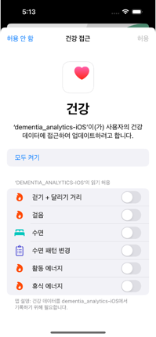 |

### 사용자 건강 데이터 관리

| 건강 데이터 확인 및 관리                                   | 애플리케이션 내 데이터 확인 및 관리                              | 애플리케이션 내 데이터 추가                                   |
|--------------------------------------------------|---------------------------------------------------|---------------------------------------------------|
| 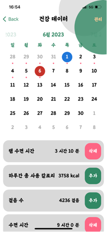 | 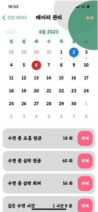 |  |

### 분석 및 시각화
| 사용자 데이터 분석 (정상인)                         | 사용자 데이터 분석 (치매 환자)                        | 차트                                              |
|------------------------------------------|-------------------------------------------|-------------------------------------------------|
| 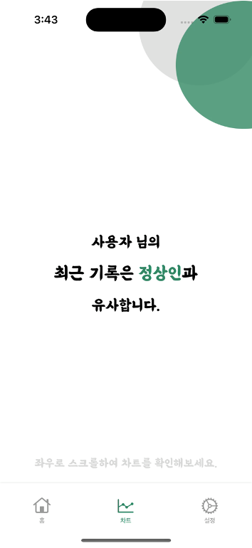 | 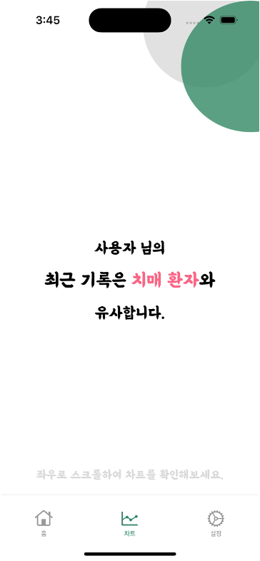 | 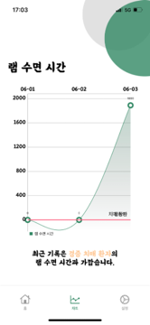 |

### 설정
| 사용자 정보 표시                                      | 사용자 정보 설정                                     |
|------------------------------------------------|-----------------------------------------------|
|  | 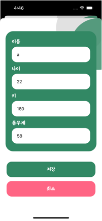 |

### 프로필 및 권한 예외 처리

| 프로필 정보 업데이트 요청                                            | 권한 요청                                            |
|-----------------------------------------------------------|--------------------------------------------------|
| 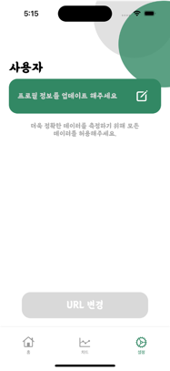 | 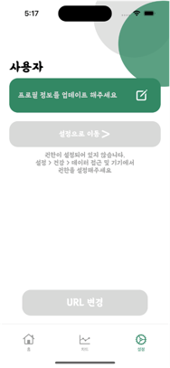 |

